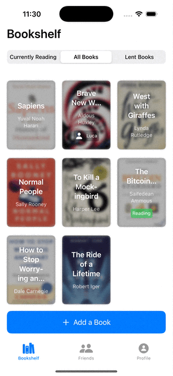
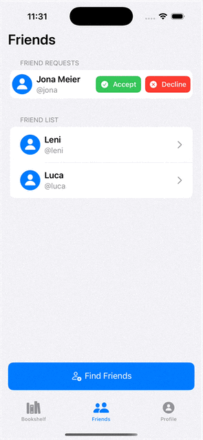
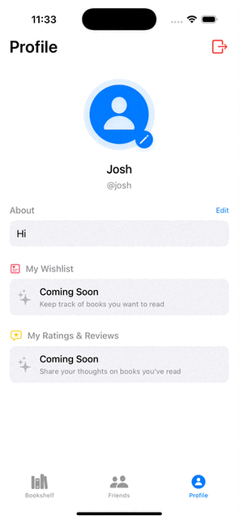

# 📚 BookshelfApp

A sleek and simple iOS application for book lovers to manage your personal library, track reading progress, and connect with friends.

## ✨ Features at a Glance

- **📚 Personal Bookshelf**: Add, organize, and manage your physical book collection
- **🔍 Book Search**: Add books to your digital collection by scanning book barcodes
- **👥 Social Features**: Connect with friends and explore their bookshelves
- **📖 Reading Tracker**: Track books you're currently reading
- **📱 Lending System**: Keep track of books you've lent to friends
- **🎨 Modern SwiftUI Interface**: Clean, intuitive UI built with SwiftUI

## 📌 Book Organization

Digitally catalog your books by scanning barcodes (ISBN lookup) or adding them manually. Organize with three intuitive shelves:  

- **"All Books" Shelf**: Your complete digital collection
- **"Currently Reading" Shelf**: Quick access to books in progress
- **"Lent Books" Shelf**: The books you've marked as "lent" to friends

## 👥 Social Features

- **Add Friends**: See their bookshelves and current reads
- **Custom Profiles**: Customize your user profile with a display name and bio
- **Loan Tracking**: Mark books as lent to friends, friends can see which are unavailable

## 🔧 Technical Stack

| Technology | Purpose |
|------------|---------|
| **SwiftUI** | Modern declarative UI framework |
| **Firebase Auth** | Secure user authentication |
| **Firestore** | Cloud database for book and user data |
| **Google Books API** | Book information retrieval |
| **CodeScanner Library** | Barcode scanning functionality |

## 🚀 Getting Started

1. Clone the repository
2. Install dependencies (Firebase Auth, Firestore, [CodeScanner library](https://github.com/twostraws/CodeScanner.git))
3. Set up your own Firebase project and add your `GoogleService-Info.plist`
4. Connect a Google Books API key (either in a new Config.swift or directly)
5. Build and run in Xcode

## 📸 Screenshots

    
    
    

## 🔮 Future Enhancements

- [ ] Directly associate loaned books with people from your friends list
- [ ] More stable and reliable implementation of backend behind friends system
- [ ] Some kind of monetization (caps on monthly ISBN scans, advanced categorization, etc.)
- [ ] Rate/review books you've read so friends can see what you like
- [ ] Create wishlists and share these with friends
- [ ] More customizability in categorizing your library, including marking books as "private"
- [ ] Publish app officially to App Store

---

Built with ❤️ and AI (mainly Claude haha)
